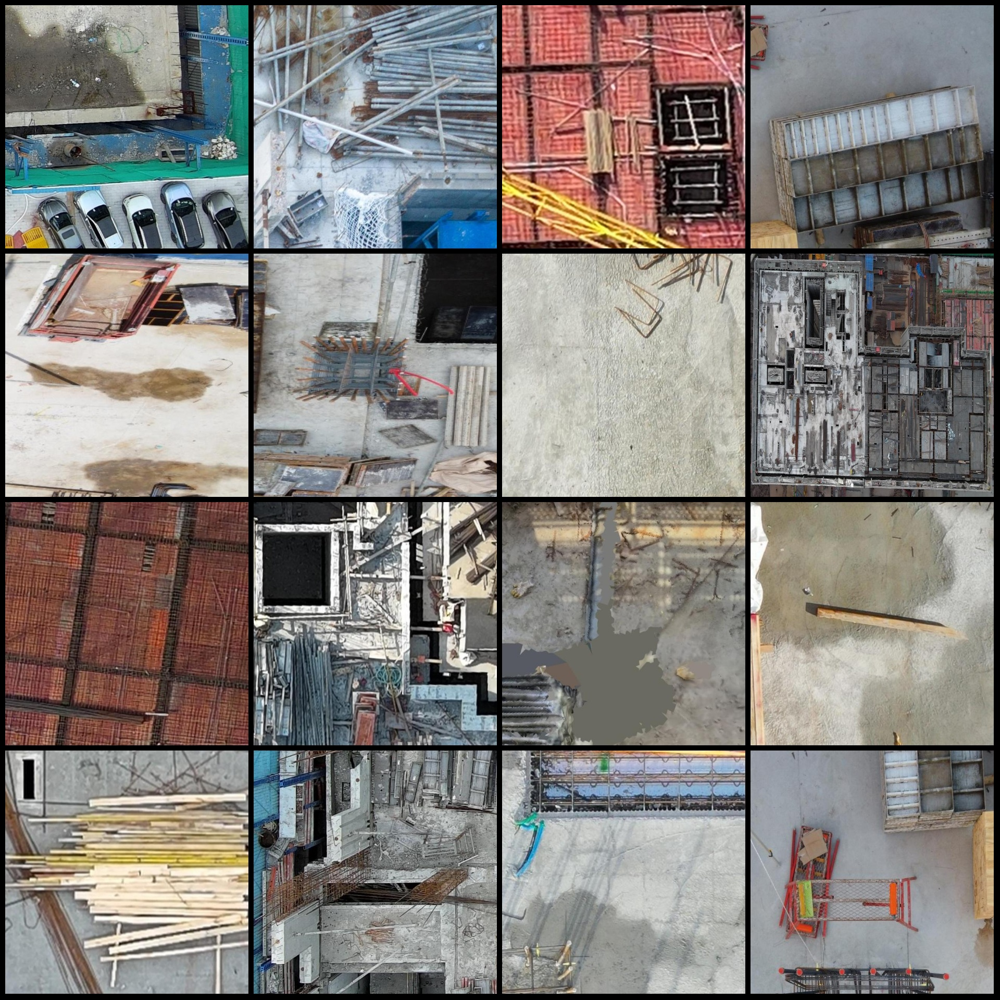
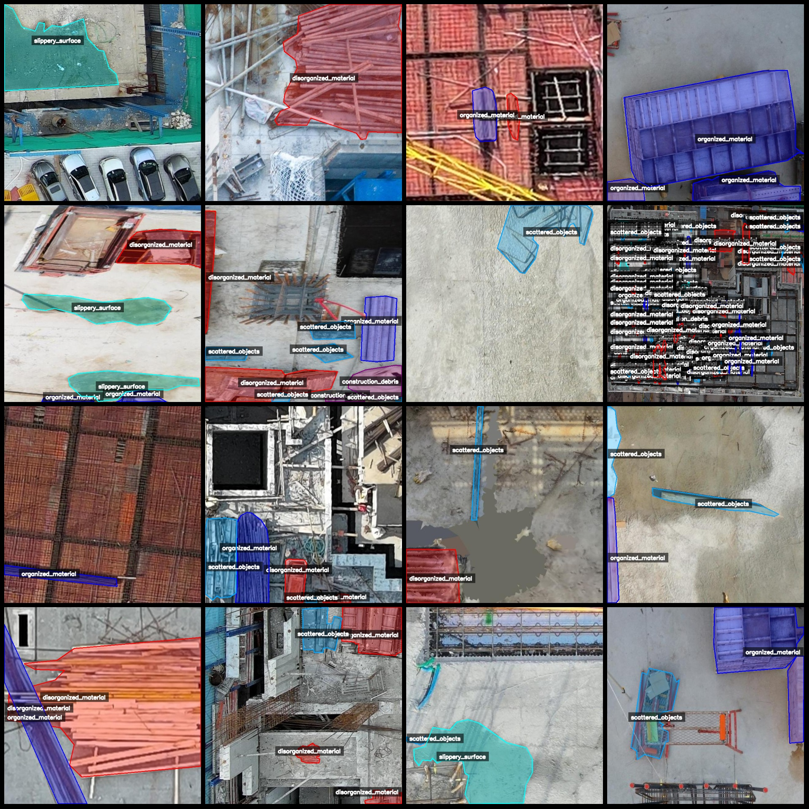
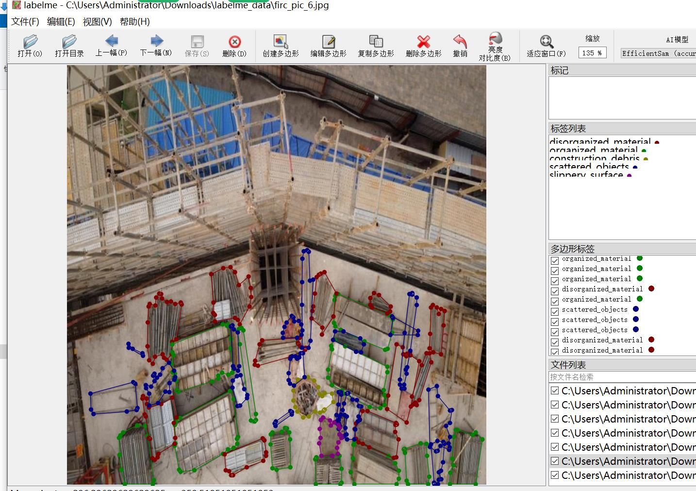

# Drone Viewpoint Aerial Photography of Building Site Materials and Waste Identification and Segmentation Dataset in LabelMe Format with 2123 Images and 5 Categories

Dataset format: LabelMe format (excluding mask files, only containing JPG images and corresponding JSON files)
Number of images (number of JPG files): 2123
Number of annotations (number of JSON files): 2123
Number of annotation categories: 5
Annotation category names: ["disorganized_material", "organized_material", "construction_debris", "scattered_objects", "slippery_surface"]
Count of boxes for each category:
- disorganized_material (Materials scattered haphazardly) count = 2343
- organized_material (Materials neatly piled up) count = 2331
- construction_debris (Construction debris) count = 642
- scattered_objects (Objects scattered) count = 4120
- slippery_surface (Slippery surface) count = 480
Total number of boxes: 9916
Annotation tool used: labelme=5.5.0
Image resolution: 640x640
Drone used: DJI Mavic Pro
Collected height: 50-60m
Collected angle: 90°
Annotation rules: Polygon is drawn around the category
Important note: The dataset can be opened and edited using LabelMe, but the JSON dataset needs to be converted into a mask or Yolo format or COCO format for semantic segmentation or instance 
segmentation.
Special declaration: This dataset does not guarantee any accuracy in the training of the models or the weight files.
Image preview:
Annotation example:
Random 16 images displayed:
Annotation drawing results:

Image

Here is a pay link on Stripe ( https://buy.stripe.com/3cs8yP7sY87d0vu9AB ). Please contact me lonlonago@foxmail.com after funding $89, and I will send you a complete data files , thank you!

